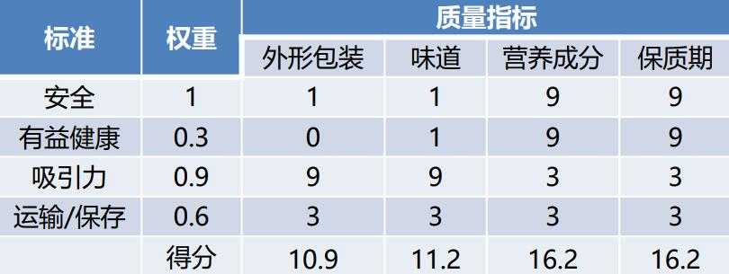

# **规划质量管理**

- 识别项目及其可交付成果的质量要求和标准，并书面描述项目将如何证明符合质量要求和标准的过程，为整个项目中如何管理和核实质量提供指南和方向

## 输入

### 【组织过程资产】

- 质量政策：组织在质量管理方面的工作方向

## 工具

### 【数据收集】

- 标杆对照
- 头脑风暴
- 访谈

### 【数据分析】

- 成本效益分析
  - 达到质量要求的效益：减少返工、提高生产率、降低成本、提升相关方满意度、提升赢利能力
- 质量成本
  - 一致性成本（为了防止失败）
    - 预防成本：培训、设备
    - 评价成本：检查测试
  - 非一致性成本（为了处理失败）
    - 内部失败成本：反工、废品
    - 外部失败成本：债务、保修、业务流失

### 【决策】

- 多标准决策分析（如优先矩阵），排定质量测量指标的优先顺序

### 【数据表现】

- 流程图
  - 估算质量成本，帮助改进过程并识别肯出现质量缺陷或可纳入质量检查的地方
- SIPOC模型
  - 供应者、输入、流程、输出、客户
- 逻辑数据模型
  - 使用商业语言描述，不依赖特定软件开发技术
- 思维导图
  - 快速收集项目质量要求、制约因素、依赖关系和联系等信息
- 矩阵图
  - 展示因素、原因和目标之间的关系强弱

## 输出

### 【质量管理计划】

- 质量政策、质量标准、质量目标、角色职责、相关活动、质量工具

### 【质量测量指标】

- 属于项目文件
- 描述项目或产品属性，以及控制质量过程将如何验证符合程度

# **管理质量**

- 把组织的质量政策用于项目，并将质量管理计划转化为可执行的质量活动的过程
- 管理质量包括所有质量保证活动，还与产品设计和过程改进有关

## 输入

### 【项目文件】

## 工具

### 【数据收集】

- 核对单

  1. 核实所要求的一系列步骤（质量活动）是否已得到执行
  2. 检查需求列表是否已得到满足

  - 核对单应与范围基准中定义的验收标准保持一致

### 【审计】

- 确定项目活动是否遵循了政策、过程和程序
- 可事先安排，也可随机进行，可由内部或外部的审计师进行
- 目标
  1. 识别最佳实践、违规做法、差距与不足
  2. 分享类似项目的良好实践
  3. 协助过程改进，提供生产效率
  4. 积累经验教训
  5. 确认已批准变更请求的实施情况

### 【数据分析】

- 文件分析
  - 质量报告、测试报告、绩效报告、偏差分析
- 根本原因分析
- 过程分析
- 备选方案分析

### 【决策】

- 多标准决策分析
  - 项目决策
  - 产品决策

### 【数据表现】

- 因果图
  - 鱼骨图、石川图、why-why分析图
  - 主要原因、根本原因
- 直方图
  - 展示数字数据的条形图
  - 集中趋势、分散程度、分布形状、特定变量发生的频率
- 帕累托图
  - 特殊的垂直条形图，使用折现显示累计百分比
  - 主要原因、二八定律、80/20法则、优先排序、有重点地采取纠正措施
- 散点图
  - 解释因变量相对于自变量的变化
  - 两个变量、回归线、强相关性

### 【面向X的设计】

- 优化设计的特定方面

### 【问题解决】

- 有助于消除问题和制定长久有效的解决方案

1. 定义（问题）
2. 识别（根本原因）
3. 方案（生成方案）
4. 选择（最佳方案）
5. 执行
6. 验证（有效性）

### 【质量改进方法】

- PDCA：计划、实施、检查、行动
- 六西格玛：出错率不能超过百万分之3.4

## 输出

### 【质量报告】

- 内容：质量问题、改善建议、纠正措施建议、发现情况的概述

### 【测试与评估文件】

- 供控制质量使用，评估质量目标的实现情况

### 【变更请求】

# **控制质量**

- 为了评估绩效，确保项目输出完整、正确且 满足客户期望，而监督和记录质量管理活动执行结果的过程
  - 核实可交付成果已达到质量要求，可供最终验收
  - 在整个项目期间进行质量控制
- 确认范围和控制质量的区别

|              | 控制质量                             | 确认范围                                 |
| ------------ | ------------------------------------ | ---------------------------------------- |
| 关注重点     | 正确性（做得对不对，质量是否有问题） | 可接受性（是否满足需求，是否能通过验收） |
| 实施方       | 一般内部QC部门进行                   | 项目发起人、客户和其他主要干系人         |
| 先后顺序     | 通常先做，也可同时进行               | 通常后做，也可同时进行                   |
| 依据         | 质量测量指标                         | 验收标准                                 |
| 交付物       | 核实的可交付成果                     | 验收的可交付成果                         |
| 实施动作英文 | Verify                               | Validate                                 |

## 输入

### 【项目文件】

- 质量测量指标
- 测试与评估文件
- 经验教训登记册

### 【批准的变更请求】

### 【可交付成果】

## 工具

### 【数据收集】

- 核对单
- 核查表
  - 收集的关于缺陷数量或后果的数据，经常使用帕累托图来展示
  - 收集数据、潜在质量问题、缺陷数量或后果、统计分析结果

- 统计抽样
  - 属性抽样
  - 变量抽样
- 文件调查

### 【数据分析】

- 绩效审查
  - 测量、比较和分析规划质量管理过程中定义的质量测量指标
- 根本原因分析

### 【检查】

- 审查、同行审查、审计、巡检
- 检验工作产品，以确定是否符合书面标准

### 【测试/产品评估】

### 【数据表现】

- 控制图
  - 确定过程是否稳定，是否有可预测的绩效
  - 规格上限和下限（USL/LSL）：可允许的最大值和最小值，超出可能受处罚（次品）
  - 控制上限和下限（UCL/LCL）：稳定过程的波动范围
  - 失控（无需停产但必须查原因）
    1. 某个点超出控制界限
    2. 连续7个点在均值上方
    3. 连续7个点在均值下方
  - 控制界限通常设在过程均值（0西格玛）+/- 3西格玛的位置

## 输出

### 【质量控制测量结果】

### 【核实的可交付成果】

- 指导与管理项目工作 —> 可交付成果

  —> 控制质量 —> 核实的可交付成果

  —> 确认范围 —> 验收的可交付成果

  —> 结束项目或阶段 —> 最终的产品服务成果

### 【变更请求和项目文件更新】

- 问题日志
  - 多次不符合质量要求的可交付成果
- 测试与评估文件
  - 使未来的测试更有效
- 风险登记册
  - 识别的新风险
- 经验教训登记册
  - 质量缺陷的来源、规避方法、有效的处理方式

# **质量管理的三个过程**

- 规划质量：定标准
- 管理质量：管过程（QA，Quality Assurance）
- 控制质量：查结果（QC，Quality Control）

## 如何避免

- 客户发现缺陷，事先应做好控制质量
- 控制质量发现缺陷，事先应做好管理质量

## 控制质量发现缺陷的处理

- 少数、部分可交付成果由缺陷：查原因，并经过变更流程进行缺陷补救
- 大量可交付成果有缺陷：反思过程做好管理质量