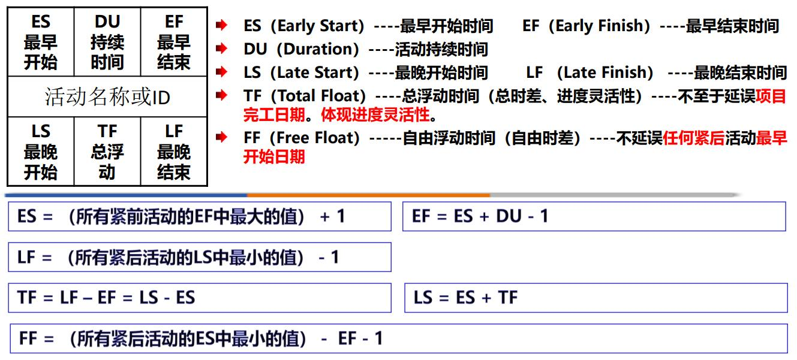
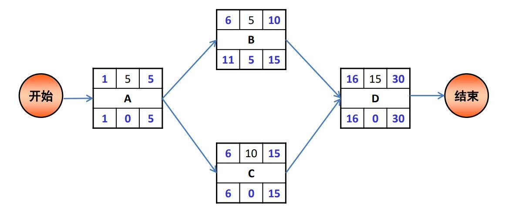

# **规划进度管理**

- 为规划、编制、管理、执行和控制项目进度而制定政策、程序和文档的过程

## 输出

### 【进度管理计划】

- 内容
  - 进度计划的发布和迭代长度
  - 准确度：持续时间估算的可接受区间及允许的应急储备数量
  - 资源的计量单位
  - 控制临界值：采取某种措施前，允许出现的最大进度偏差
  - 绩效测量规则

# **定义活动**

- 识别和记录为完成项目可交付成果而需采取的具体行动的过程，将动作包分解为活动

## 输入

### 【项目管理计划】

- 范围基准

## 工具

### 【分解】

### 【滚动式规划】

## 输出

### 【活动清单】

### 【里程碑清单】

- 可以是强制性或选择性的
- 不是活动，持续时间为零，只代表一个时间点

### 【变更请求】

- 将可交付成果渐进明细为活动的过程中，可能发现不属于项目基准的工作

### 【项目管理计划更新】

- 进度基准
- 成本基准

# **排列活动顺序**

- 识别和记录项目活动之间的关系的过程，定义逻辑顺序，获得最高的效率

## 工具

### 【紧前关系绘图法PDM】

- 节点法、AON、前导图法、单代号法
- 节点表示活动，用逻辑关系连接活动，显示实施顺序
- PDM的四种逻辑关系
  - FS：紧前活动完成，紧后活动才能开始
  - FF：紧前活动完成，紧后活动才能完成
  - SS：紧前活动开始，紧后活动才能开始
  - SF：紧前活动开始，紧后活动才能完成

### 【确定和整合依赖关系】

- 强制性依赖关系
- 选择性依赖关系
  - 使用快速跟进应审查相应的选择性依赖关系
- 外部依赖关系
  - 项目活动与非项目活动之间，项目团队不可控
- 内部依赖关系
  - 项目活动之间，项目团队可控
- 两两组合：强制性外部关系、强制性内部关系、选择性外部关系、选择性内部关系

### 【提前量和滞后量】

- 提前量：紧后活动可以提前的时间量（FS-3）
- 滞后量：紧后活动必须推迟的时间量（FS+3）

## 输出

### 【项目进度网络图】

# **估算活动持续时间**

- 根据资源估算的结果，估算完成单项活动所需工期的过程，由项目团队中最熟悉具体活动的个人或小组提供估算所需的各种输入

## 工具

### 【储备分析】

- 应急储备
  - 应对已经接受的已识别风险
  - 已知 — 未知，事先能识别出来的（想得到的） — 不需要（不能）主动管理
  - 在基准中，可直接使用，不需要走变更流程
- 管理储备
  - 应对不可预见的工作
  - 未知 — 未知，事先不能识别出来的（想不到的） — 不需要（不能）主动管理
  - 不在基准中，需要走变更流程

### 【三点估算】

- 源自计划评审技术（PERT），考虑估算中的不确定性和风险
- 贝塔分布：期望值（平均值） = （最乐观 + 最悲观 + 最可能*4）/ 6

## 输出

### 【持续时间估算】

### 【估算依据】

# **制定进度计划**

- 分析活动顺序、持续时间、资源需求和进度制约因素，创建进度模型，从而落实项目执行和监控的过程

## 工具

### 【进度网络分析】

### 【关键路径法CPM】

- 关键路径是时间最长的活动顺序，决定着可能的项目最短工期
- 总浮动时间：活动延期但不至于延误项目完工日期，体现进度灵活性
- 自由浮动时间：活动延期但不延误任何紧后活动最早开始日期
- 关键路径的总浮动时间可能是正值、零或负值
- 关键路径法排出来的进度计划未必可行，关键路径法不考虑资源约束，需要配合资源平衡处理

1. 顺推求ES、EF
2. 逆推求LS、LF、TF

- 关键路径为时间最长的活动顺序：ACD = 30天（最短工期）
- 各活动的TF：A —> 0，B —> 5，C —> 0，D —> 0
- 各活动的FF：A —> 6-5-1=0，B —> 16-10-1=5，C —> 16-15-1=0

### 【资源优化】

- 资源平衡
  - 往往造成关键路径延长

- 资源平滑
  - 只在自由和总浮动时间内延迟，不会改变关键路径

### 【数据分析】

- 假设情景分析
- 模拟
  - 蒙特卡洛分析：

### 【提前量和滞后量】

- 提前量：紧后活动可以提前的时间量（FS-3）
- 滞后量：紧后活动必须推迟的时间量（FS+3）

### 【进度压缩】

- 赶工
  - 造成成本、风险增加
  - 适用于增加资源就能缩短持续时间，且位于关键路径上的活动
- 快速跟进
  - 顺序进行的活动改为部分并行
  - 适用于互为选择性依赖关系的活动

- 选择顺序
  - 不计成本缩短关键路径：赶工
  - 没有额外资源/成本不可超支：快速跟进
  - 无明确限制条件：进度压缩 > 赶工 > 快速跟进

### 【项目管理信息系统PMIS】

### 【敏捷发布规则】

## 输出

### 【进度基准】

- 包含基准的开始、结束日期，用作与实际结果进行比较的依据

### 【项目进度计划】

- 里程碑图
  - 了解主要交付成果的计划开始或完成日期
- 横道图、甘特图
  - 追踪活动进度
- 项目进度网络图（PDM、ADM）
  - 优化活动之间的关系

### 【项目日历】

# **控制进度**

- 监督项目状态，更新项目进展，管理进度基准变更的过程

- 敏捷中，对剩余工作计划重新进行优先级排序

## 工具

### 【数据分析】

- 挣值分析
- 迭代燃尽图
- 绩效审查
- 趋势分析
- 偏差分析
- 假设情景分析

## 输出

### 【项目绩效信息】

### 【进度预测】