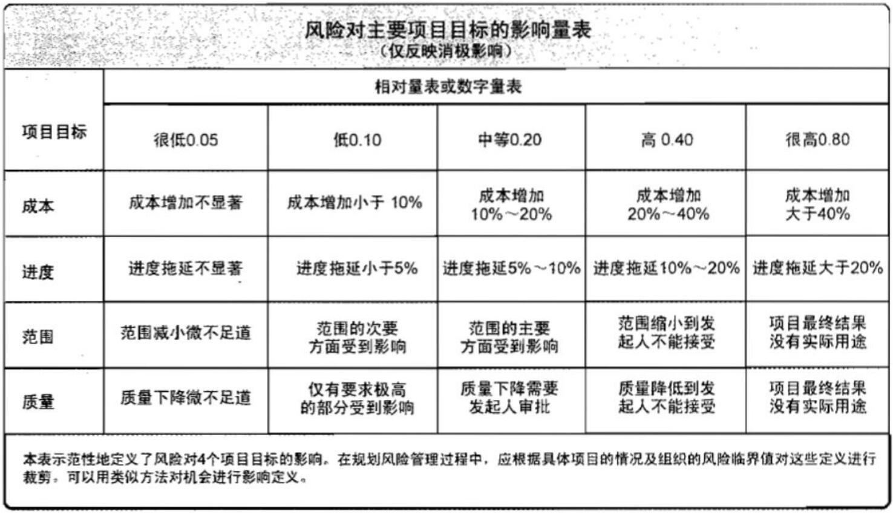
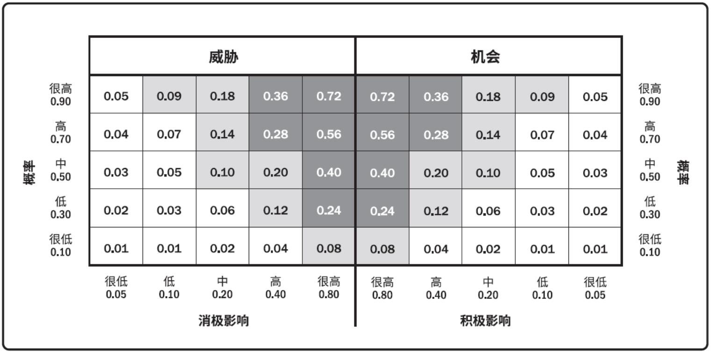

- 风险的三要素
  - 风险事件、概率、影响
- 三种性质的项目风险
  - 已知—已知风险：已识别，可规划应对措施（计入时间/成本）
  - 已知—未知风险：已识别，但无法或不需要主动管理（应急储备）
  - 未知—未知风险：未识别，无法主动管理（管理储备）
- 影响风险态度的因素
  - 风险承受力
  - 风险偏好
  - 风险临界值
- 识别了风险
  - 更新风险登记册，查阅风险登记册，记录在风险登记册
- 发生了风险
  - 已知风险：查阅风险登记册，直接应对，使用应急储备
  - 未知风险或应对无效的已知风险：采取权变措施，提交变更请求，使用管理储备
- 风险管理顺序
  1. 识别
  2. 定性（必须要做）
  3. 定量（可以不做）
  4. 规划应对
  5. 实施应对

## 规划风险管理

- 定义如何实施项目风险管理活动的过程
- 确保风险管理的水平、方法和可见度与项目风险程度，及项目对组织和其他相关方的重要程度相匹配

### 输入

#### 项目章程

- 有高层级风险

#### 项目文件

- 相关方登记册
  - 确定项目风险管理的角色和职责，已经为项目设定风险临界值

### 工具

#### 数据分析

- 相关方分析
  - 确定风险偏好

### 输出

#### 风险管理计划

- 描述如何安排与实施风险管理活动，**风险管理计划无风险**

- 内容

  - 风险管理战略、方法论、资金、时间安排

  - 角色与职责

  - 风险类别

    - 风险分解结构
      - 潜在风险来源的层级展现

    

  - 相关方风险偏好

  - 风险概率和影响定义

    

  - 概率和影响矩阵

    - 把每个方向发生的概率和一旦发生对项目目标的影响映射起来的表格

    

  - 报告格式、跟踪

## 识别风险

- 识别单个项目风险以及整体项目风险的来源，并记录风险特征的过程

### 输入

#### 项目管理计划

#### 项目文件

#### 协议

#### 采购文档

#### 事业环境因素

#### 组织过程资产

### 工具

#### 数据收集

- 头脑风暴

- 访谈

- 核对单
  - 有具体的风险

#### 数据分析

- 根本原因分析
- 假设条件和制约因素分析
- 文件分析
- SWOT分析

#### 人际关系与团队技能

#### 提示清单

- 识别单个项目风险以及可作为整体项目风险来源的风险类别预设清单
- 可使用风险分解结构底层的风险类比作为提示清单

### 输出

#### 风险登记册

- 记录已识别单个项目风险的详细信息
- 风险登记册的编制开始于识别风险过程
- 内容
  - 已识别风险清单
  - 潜在风险责任人
  - 潜在应对措施清单

#### 风险报告

- 概述信息
- 编制需要渐进式

## 实施定性风险分析

- 通过评估单个项目风险发生的概率和影响以及其他特征，**对风险进行优先级排序**，从而为后续分析或行动提供基础的过程

- 本过程确定**每个风险的责任人**
- 实施定性风险分析**在整个项目生命周期中定期开展**，敏捷开发环境中在每次迭代开始前进行
- 本过程完成后可进入**实施定量风险分析过程**或直接进入规划风险应对过程

### 工具

#### 数据分析

- 风险数据质量评估
- 风险概率和影响评估
  - 对已识别的每个风险都要进行概率和影响评估
  - 低概率和影响的风险将被列入风险登记册中的观察清单，供未来监控
- 其他风险参数评估

#### 风险分类

- 分类标准
  - 风险分解结构RBS
  - 工作分解结构WBS
  - 项目阶段、预算、角色和职责
  - 共同的根本原因
- 目的
  - 将注意力和精力集中到风险敞口最大的领域
  - 针对相关的风险制定通用的风险应对措施

#### 数据表现

- 概率和影响矩阵
- 层级图
  - 使用了两个以上参数对风险分类，不能使用概率和影响矩阵
  - 气泡图
    - X轴值、Y轴值和气泡大小来表示风险的三个参数

## 实施风险定量分析

- 就已识别的单个项目风险和不确定性的其他来源对整体项目目标的影响进行定 量分析的过程

- 不是所有的项目都需要实施定量风险分析
- 实施风险定量分析是评估所有单个项目风险对项目整体的综合影响的唯一可靠方法
- 对象是定性分析中评估为**有重大潜在影响且能被量化**的单个项目风险信息

- 可在规划风险应对过程后进行，以分析应对措施对降低整体项目风险的有效性

### 工具

#### 数据收集

- 访谈

#### 不确定性表现方式

- 使用概率分布来表示可能区间

#### 数据分析

- 模拟
  - 蒙特卡洛

- 敏感性分析
  - 一种单因素分析
  - 将所有其他不确定因素固定在基准值，考虑每个因素的变化对目标产生的影响
  - 常用龙卷风图

- 决策树分析
  - 计算每条分支的预期货币价值（EMV，Expected Monetary Value）
  - 建立在风险中立的假设之上，既不避险，也不冒险

- 影像图
  - 不确定条件下决策制定的图形辅助工具

### 输出

#### 项目文件更新

- 更新风险报告

## 规划风险应对

- 为处理整体项目风险敞口，以及应对单个项目风险，而制定可选方案、选择应对策 略并商定应对行动的过程
- 风险应对措施
  - 与风险的重要性相匹配
  - 能经济有效地应对挑战
  - 现实可行
  - 能获得全体相关方的同意
  - 由一名责任人（风险应对责任人）具体负责
- 次生风险：实施风险应对措施而直接导致的风险，规划风险应对时需识别次生风险
- 残余风险：执行风险应对计划后仍残留的风险，通常可接受

### 工具

#### 威胁应对策略

- 上报

  - 上报给其目标会受该威胁影响的那个层级
  - 上报后项目团队不再进一步监督

- 规避

  - 适用于发生概率较高且有严重负面影响的高优先级威胁
  - 让风险不发生或让项目免受影响
  - 延长进度、改变策略、缩小范围、澄清需求、获取信息、改善沟通、取得专有技能

- 转移

  - 将责任转移给第三方，让第三方承担影响，并非消除风险，需支付费用
  - 保险、使用履约保函、担保、保证书、外包

- 减轻

  - 将概率或影响降低到可接受的临界值内
  - 采用较简单的流程、进行更多测试、选用更可靠的卖方、原型开发、加入冗余部件

- 接收

  - 适用于低优先级威胁或无法进行经济有效地应对的威胁

  - 不主动采取措施

  - 主动接收：建立应急储备

    被动接收：记录策略，定期复查

#### 机会应对策略

- 上报

  - 上报给其目标会受该机会影响的那个层级
  - 上报后项目团队不再进一步监督

- 开拓

  - 适用于高优先级机会
  - 将发生概率提高到100%
  - 分配最有能力的资源、最高级的技术
  - 把组织中最有能力的资源分配给项目来缩短完工时间

- 分享

  - 将责任转移给第三方，使其享有机会带来的部分收益
  - 建立合伙关系、合作团队、特殊公司、合资企业

- 提高

  - 提高机会出现的概率或影响
  - 为早日完成活动增加资源（普通的资源）

- 接收

  - 适用于低优先级机会或无法进行经济有效地应对的机会

  - 不主动采取措施

  - 主动接收：建立应急储备

    被动接收：记录策略，定期复查

#### 应急应对策略

- 仅在**特定事件发生**时才采用的应对措施
- 若确信风险发生有预警信号，应制定应急应对策略
- 应急应对策略制定的风险应对计划称为应急计划或弹回计划，包括已识别的、用于启动计划的触发事件

#### 整体项目风险应对策略

- 规避

  - 适用于风险有严重负面影响，并已超出风险临界值
  - 弱化负面影响，拉回临界值以内
  - 取消项目范围中的高风险工作，取消项目（最极端）

- 开拓

  - 适用于风险有显著正面影响，并已超出风险临界值
  - 获得不确定性对项目的正面影响
  - 增加高收益的工作，与关键相关方协商修改项目风险临界值

- 转移或分享

  - 适用于风险的级别很高，且无法有效应对

  - 负面风险：转移策略，支付费用

    正面风险：多方分享，获得利益

  - 建立协作式业务结构、成立合资企业或特殊目的公司、分包关键工作

- 减轻或提高

  - 变更风险的级别
  - 重新规划项目、改变项目范围和边界、调整项目优先级、改变资源配置、调整交付时间

- 接收

  - 不主动采取措施

  - 主动接收：建立整体应急储备

    记录策略，定期复查

#### 数据分析

- 备选方案分析
- 成本效益分析
  - 策略的有效性 = 应对的结果 / 应对花费的成本

### 输出

#### 项目文件更新

- 风险登记册
  - 应对策略、具体行动
  - 预警信号
  - 应急计划、弹回计划、残余风险、次生风险
- 风险报告

#### 变更请求

#### 项目管理计划更新

- 范围基准
- 进度基准
- 成本基准

## 实施风险应对

- 执行商定的风险应对计划的过程

### 工具

#### 人际关系与团队技能

- 影响力
  - 施展影响力，鼓励指定的风险责任人采取行动

## 监督风险

- 在整个项目期间，监督商定的风险应对计划的实施、跟踪已识别风险、识别和分析新风险，以及评估风险管理有效性的过程
- 使项目决策都基于关于整体项目风险敞口和单个项目风险的当前信息

### 输入

#### 风险登记册

### 工具

#### 数据分析

- 技术绩效分析
  - 实际结果偏离计划的程度可代表威胁或机会的潜在影响
- 储备分析
  - 比较剩余应急储备与剩余风险量

#### 风险审计

- 评估风险管理过程的有效性
- 第二大审计，针对过程

#### 会议

- 风险审查会
- 定期进行风险审查，检查和记录风险应对的有效性，识别新风险，重新评估当前风险，关闭已过时风险，讨论风险发生所引发的问题，总结经验教训
- 可以说定期项目状态会中的一项议程，也可以召开专门的风险审查会

### 输出

#### 项目文件更新

- 风险登记册
