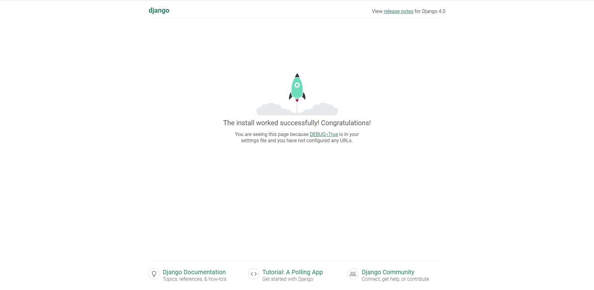

## Django相关使用

## 创建项目

#### 创建项目

> django-admin startproject avatar

#### 目录结构

> tree avatar

```
avatar
├── avatar
│   ├── asgi.py
│   ├── __init__.py
│   ├── settings.py
│   ├── urls.py
│   └── wsgi.py
└── manage.py

1 directory, 6 files
```

- avatar：项目的容器
- manage.py：命令行工具，与Django项目进行交互
- asgi.py：一个ASGI兼容的Web服务器入口，以便运行项目
- \__init__.py：空文件，告诉Python该目录是一个Python包

- settings.py：该Django项目的配置文件
- urls.py：该Django项目的URL声明
- wsgi.py：一个WSGI兼容的Web服务器入口，以便运行项目

#### 修改默认数据库

- 创建数据库

```sql
create database djangodb;
```

- avatar/settings.py

```python
DATABASES = {
    # 'default': {
    #     'ENGINE': 'django.db.backends.sqlite3',
    #     'NAME': BASE_DIR / 'db.sqlite3',
    # }
    'default': 
    { 
        'ENGINE': 'django.db.backends.mysql',
        'NAME': 'djangodb',
        'HOST': '192.168.1.100',
        'PORT': 3306,
        'USER': 'root',
        'PASSWORD': '******',
    }  
}
```

- avatar/\__init__.py

```python
import pymysql
pymysql.install_as_MySQLdb()
```

- 进行数据库迁移

> python3 manage.py migrate

#### 启动服务

- avatar/settings.py

> Invalid HTTP_HOST header: '192.168.1.101:8000'. You may need to add '192.168.1.101' to ALLOWED_HOSTS.

```python
# ALLOWED_HOSTS：Django网站可以服务的主机/域名列表，用于防止跨站请求伪造
ALLOWED_HOSTS = ['192.168.1.101']
```

> python3 manage.py runserver 192.168.1.101:8000




## 创建应用

#### 创建应用

> python3 manage.py startapp demo

#### 创建视图

- demo/views.py

```python
# from django.shortcuts import render
from django.http import HttpResponse

def test(request):
    return HttpResponse("Test App")
```

#### 映射配置

- demo/urls.py

```python
from django.urls import path
from . import views

urlpatterns = [
    path('', views.test),
]
```

- avatar/urls.py

```python
from django.contrib import admin
from django.urls import path,include

urlpatterns = [
    path('admin/', admin.site.urls),
    path('apptest/', include('demo.urls')),
]
```

- path()的参数
  - 必须参数
    - route：URL
    - view：视图函数
  - 可选参数
    - kwargs：传递给视图函数的字典类型参数
    - name：引用URL时的名称

#### 访问应用

- 127.0.0.1:8000/demo

## 创建模板

#### 创建模板目录

- 项目根目录下创建templates

#### 创建模板

- templates/demo.html

```html
<h1>{{var}}</h1>
```

#### 设置模板文件路径

- avatar/settings.py
  - 设置DIRS

```python
TEMPLATES = [
    {
        'BACKEND': 'django.template.backends.django.DjangoTemplates',
        'DIRS': [Path(BASE_DIR,'templates')],
        'APP_DIRS': True,
        'OPTIONS': {
            'context_processors': [
                'django.template.context_processors.debug',
                'django.template.context_processors.request',
                'django.contrib.auth.context_processors.auth',
                'django.contrib.messages.context_processors.messages',
            ],
        },
    },
]
```

#### 创建视图

- 模板语法
  - html：{{html变量名}}
  - view：{'html变量名':'view变量名'}

- demo/views.py

```python
from django.shortcuts import render

def templatestest(request):
    context = {}
    context['var'] = 'Test template'
    return render(request, 'demo.html', context)

# def test(request):
#   views_var = 'Test template'
#   return render(request, 'demo.html', {'var':views_var})
```

- 列表

```python
def test(request):
  views_list = ['var1', 'var2', 'var3']
  return render(request, 'demo.html', {'var':views_list})
```

```html
<h1>{{var}}</h1>
<h1>{{var.0}}</h1>
```

> ['var1', 'var2', 'var3']
>
> var1

- 字典

```python
def test(request):
  views_dict = {'key1':'var1', 'key2':'var2'}
  return render(request, 'demo.html', {'var':views_dict})
```

```html
<h1>{{var}}</h1>
<h1>{{var.key1}}</h1>
```

> {'key1': 'var1', 'key2': 'var2'}
>
> var1


#### 映射配置

- demo/urls.py

```python
from django.urls import path
from . import views

urlpatterns = [
    path('', views.test),
    path('templatestest', views.templatestest),
]
```

#### 访问应用

- 10.0.43.108:8000/templatetest

#### 模板的继承

- templates/base.html

```html
<h1>Template Inheritance</h1>

父模板内容

```

- templates/demo.html

```html


子模板内容

```


## 静态文件配置

- 项目根目录下创建statics
- 创建目录
  - css
  - js
  - images
  - plugins

- avatar/settings.py

```python
# STATIC_URL = 'static/'
STATIC_URL = '/static/'
STATICFILES_DIRS = [ 
    Path(BASE_DIR, "statics"), 
]
```

- 引用静态文件
  - 使用别名static进行引用

```html

```

```html


```

## 默认数据库变更

#### 创建数据库

```sql
create database djangodb;
```

#### 修改配置文件

- avatar/settings.py

```python
DATABASES = {
    # 'default': {
    #     'ENGINE': 'django.db.backends.sqlite3',
    #     'NAME': BASE_DIR / 'db.sqlite3',
    # }
    'default': 
    { 
        'ENGINE': 'django.db.backends.mysql',
        'NAME': 'djangodb',
        'HOST': '127.0.0.1',
        'PORT': 3306,
        'USER': 'root',
        'PASSWORD': '******',
    }  
}
```

#### 指定MySQL引擎

- avatar/\__init__.py

```python
import pymysql
pymysql.install_as_MySQLdb()
```

#### 进行数据库迁移

> python3 manage.py migrate

## 模型使用

#### 创建应用

> python3 manage.py startapp ModelTest

#### 编辑模型文件

- TestModel/models.py

```python
from django.db import models

class PRD_PD_INST(models.Model):
    PROD_INST_ID = models.CharField(max_length=30)
    ACCS_NBR = models.CharField(max_length=30,null=True)
```

#### 添加到应用程序

- avatar/settings.py

```python
INSTALLED_APPS = [
    'django.contrib.admin',
    'django.contrib.auth',
    'django.contrib.contenttypes',
    'django.contrib.sessions',
    'django.contrib.messages',
    'django.contrib.staticfiles',
    'ModelTest',
]
```

#### 生成迁移文件

> python3 manage.py makemigrations ModelTest

```
Migrations for 'ModelTest':
  ModelTest\migrations\0001_initial.py
    - Create model PRD_PD_INST
```

- 通过makemigrations命令，Django检测对模型的修改，并生成迁移文件

```python
from django.db import migrations, models


class Migration(migrations.Migration):

    initial = True

    dependencies = [
    ]

    operations = [
        migrations.CreateModel(
            name='PRD_PD_INST',
            fields=[
                ('id', models.BigAutoField(auto_created=True, primary_key=True, serialize=False, verbose_name='ID')),
                ('PROD_INST_ID', models.CharField(max_length=30)),
            ],
        ),
    ]
```

- 查看迁移文件对应的SQL
  - 主键id会被自动创建

> python3 manage.py sqlmigrate ModelTest 0001

```
--
-- Create model PRD_PD_INST
--
CREATE TABLE `ModelTest_prd_pd_inst` (`id` bigint AUTO_INCREMENT NOT NULL PRIMARY KEY, `PROD_INST_ID` varchar(30) NOT NULL);
```

#### 应用数据库迁移

> python3 manage.py migrate ModelTest

```
Operations to perform:
Apply all migrations: ModelTest
Running migrations:
Applying ModelTest.0001_initial... OK
```

#### 撤销迁移

- 通过上一次迁移的编号撤销迁移

> python3 manage.py migrate ModelTest 0001

```
Operations to perform:
  Target specific migration: 0001_initial, from ModelTest
Running migrations:
  Rendering model states... DONE
  Unapplying ModelTest.0002_prd_pd_inst_accs_nbr... OK
```

- 撤销一个应用的所有迁移

> python3 manage.py migrate ModelTest zero

## 数据库操作

- demo/urls.py

```python
from django.urls import path
from . import views,dboperate

urlpatterns = [
    path('', views.test),
    path('templatestest/', views.templatestest),
    path('dbinsert/', dboperate.insert),
    path('dbselect/', dboperate.select),
    path('dbupdate/', dboperate.update),
    path('dbdelete/', dboperate.delete),
]
```

- demo/dboperate.py

```python
from django.http import HttpResponse
from ModelTest.models import PRD_PD_INST
 
def insert(request):
    insert1 = PRD_PD_INST(PROD_INST_ID='00001')
    insert1.save()
    return HttpResponse("<p>Insert Completed</p>")

def select(request):
    # 获取全部
    list = PRD_PD_INST.objects.all()
        
    # 查询符合条件的数据
    # list = PRD_PD_INST.objects.filter(PROD_INST_ID='00001')

    # 查询只有一条的数据，若有多条会报错
    # list = PRD_PD_INST.objects.get(PROD_INST_ID='00001') 
    
    # 限制返回的数据，返回五条再跳过前两条
    # list = PRD_PD_INST.objects.order_by('id')[2:5]
    
    #数据排序
    # list = PRD_PD_INST.objects.order_by("PROD_INST_ID")
    
    response = ""
    tmp = ""
    for var in list:
        tmp += var.PROD_INST_ID + " "
    response = tmp
    return HttpResponse("<p>" + response + "</p>")

def update(request):
    # 更新符合条件的数据
    PRD_PD_INST.objects.filter(PROD_INST_ID='00001').update(PROD_INST_ID='00002')

    # 更新只有一条的数据，若有多条会报错
    # update1 = PRD_PD_INST.objects.get(PROD_INST_ID='00001')
    # update1.name = '00002'
    # update1.save()
    
    # 修改全部
    # PRD_PD_INST.objects.all().update(PROD_INST_ID='00002')
    return HttpResponse("<p>Update Completed</p>")

def delete(request):
    # 删除符合条件的数据
    PRD_PD_INST.objects.filter(PROD_INST_ID='00001').delete()

    # 删除只有一条的数据，若有多条会报错
    # delete1 = PRD_PD_INST.objects.get(PROD_INST_ID='00001')
    # delete1.delete()
    
    # 删除全部
    # PRD_PD_INST.objects.all().delete()
    return HttpResponse("<p>Delete Completed</p>")
```

## 表单使用

#### 创建表单类

- dmeo/forms.py

```python
from django import forms

class SearchForm(forms.Form):
    search_target = forms.CharField(label='搜索项', max_length=100)
```

#### 创建视图

- dmeo/formviews.py

```python
from django.http import HttpResponse
from django.shortcuts import render,redirect

from .forms import SearchForm

def post_search(request):
    if request.method == 'POST':
        form = SearchForm(request.POST)

        if form.is_valid():
            return HttpResponse('搜索的内容为: ' + form.cleaned_data.get('search_target'))
            # return HttpResponse(form.cleaned_data.get('search_target'))
    else:
        form = SearchForm()

    return render(request, 'forms.html', {'form': form})
```

#### 创建模板

- templates/forms.html
  - POST方式提交表单必须要csrf标签（跨站请求伪造保护）
  - 表单渲染选项
    - {{ form.as_table }} will render them as table cells wrapped in <tr> tags
    - {{ form.as_p }} will render them wrapped in <p> tags
    - {{ form.as_ul }} will render them wrapped in <li> tags

```html
<form action="/demo/search/" method="post">
    
    {{ form }}
    <input type="submit" value="搜索">
</form>
```

- Django渲染的表单

```html
<form action="/demo/search/" method="post">
    <input type="hidden" name="csrfmiddlewaretoken" value="CJRbcjxLa71zKlHXGsRlBmHSlufHFd7llv7cdOOzPJ584dk5jkbqUmwBYjOHDQKs">
    <label for="id_search_target">搜索项:</label>
    <input type="text" name="search_target" maxlength="100" required="" id="id_search_target">
    <input type="submit" value="搜索">
</form>
```

#### 映射配置

- demo/uls.py

```python
from django.urls import path
from . import views,dboperate,formviews

urlpatterns = [
    path('', views.test),
    path('templatestest/', views.templatestest),
    path('dbinsert/', dboperate.insert),
    path('dbselect/', dboperate.select),
    path('dbupdate/', dboperate.update),
    path('dbdelete/', dboperate.delete),
    path('search/', formviews.post_search),
]
```

## 视图使用

- 视图函数接收Web请求并返回Web响应

#### HttpRequest对象

- GET
  - QueryDict，包含HTTP GET的所有参数
  - get()：返回字符串，若该键对应多个值，返回最后一个

- POST
  - QueryDict，包含HTTP POST的所有参数
  - get()：返回字符串，若该键对应多个值，返回最后一个

- body
  - 二进制字节流，请求体，用于POST

- path
  - 字符串，获取URL中的路径部分

- method
  - 字符串，获取当前请求的方式，结果为大写

#### HttpResponse对象

- HttpResponse()
  - 返回文本
  - 参数为字符串，可通过参数中的html标签进行渲染
  - from django.http import HttpResponse

```py
return HttpResponse('提交成功')
```

- render()
  - 返回文本
  - 第一个参数：request
  - 第二个参数：字符串，页面名称
  - 第三个参数：字典，可选参数
  - from django.shortcuts import render,redirect

```python
return render(request, 'index.html', ctx)
```

- redirect()
  - 重定向，跳转到新页面
  - 参数为字符串，页面路径
  - from django.shortcuts import redirect

```python
return redirect('/index/')
```

## 映射配置

- 根据请求URL判断对应的处理程序，为URL和视图建立映射关系

#### 路径转换

- int：匹配0或任何正整数
- str：匹配除'/'外的非空字符串

#### 正则匹配

- 分为有命名和无命名模式，无命名模式获取参数时按顺序匹配

#### 引用路径

- 引用其他的URL配置模式或文件

#### 参数传递

- 可传递额外参数给视图函数
- include中的URLconf会收到父URLconf的参数（捕获的参数和传递的参数）

```python
from django.urls import path,re_path,include
from . import urldemo

extra_patterns = [
    path('include_test/', urldemo.include_test),
]

urlpatterns = [
    # 路径转换
    path('converter_test/<int:year>/', urldemo.converter_test1),
    path('converter_test/<str:name>/<int:year>/', urldemo.converter_test2),
    # 正则匹配
    re_path(r'^regular_test/(?P<year>[0-9]{4})/$', urldemo.regular_test),
    re_path(r'^unnamed_regular_test/([0-9]{4})/$', urldemo.unnamed_regular_test),
    # 引用路径
    path('include_test1/', include('kgdemo.urls')),
    path('include_test2/', include(extra_patterns)),
    # 参数传递
    path('args_test/<str:id>/', urldemo.args_test, {'name':'avatar'}),
]
```

```python
from django.http import HttpResponse

def converter_test1(request,year):
    print(request.path)
    print(year)
    return HttpResponse("converter_test1")

def converter_test2(request,name,year):
    print(request.path)
    print(name,year)
    return HttpResponse("converter_test2")

def regular_test(request,year):
    print(request.path)
    print(year)
    return HttpResponse("regular_test")

def unnamed_regular_test(request,year):
    print(request.path)
    print(year)
    return HttpResponse("unnamed_regular_test")

def include_test(request):
    print(request.path)
    return HttpResponse("include_test")

def args_test(request,id,name):
    print(request.path)
    print(id,name)
    return HttpResponse("args_test")
```

#### 反向解析

- 在映射配置文件中设置别名，在视图和模板中根据别名获取路径

- 普通路径

```python
from django.urls import path
from . import formviews

urlpatterns = [
    path('index/', formviews.index, name='index'),
    path('search/', formviews.post_search, name='search'),
]
```

```python
from django import forms

class SearchForm(forms.Form):
    search_target = forms.CharField(label='搜索项', max_length=100)
```

```html
<form action="" method="post">
    
    {{ form }}
    <input type="submit" value="搜索">
</form>
```

```python
from django.shortcuts import render,redirect
from django.urls import reverse

from .forms import SearchForm

def index(request):
    if request.method == 'POST':
        form = SearchForm(request.POST)
    else:
        form = SearchForm()
    return render(request, 'forms.html', {'form': form})

def post_search(request):
    if request.method == 'POST':
        form = SearchForm(request.POST)
        if form.is_valid():
            print(form.cleaned_data.get('search_target'))
            return redirect(reverse('index'))
    else:
        form = SearchForm()
    return render(request, 'forms.html', {'form': form})
```

- 有命名正则路径

```python
from django.urls import re_path
from . import formviews

urlpatterns = [
    re_path(r'^index/(?P<info>[a-z\u4E00-\u9FA5]+)/$', formviews.index, name='index'),
    re_path(r'^operate/(?P<info>[a-z\u4E00-\u9FA5]+)/$', formviews.operate, name='operate'),
]
```

```python
from django import forms

class SearchForm(forms.Form):
    search_target = forms.CharField(label='搜索项', max_length=100)
```

```html
<form action="" method="post">
    
    {{ form }}
    <input type="submit" value="搜索">
</form>
```

```python
from django.shortcuts import render,redirect
from django.urls import reverse

from .forms import SearchForm

def index(request,info):
    if request.method == 'POST':
        form = SearchForm(request.POST)
    else:
        form = SearchForm()
    print('index', info)
    return render(request, 'forms.html', {'form': form})

def operate(request,info):
    if request.method == 'POST':
        form = SearchForm(request.POST)
        if form.is_valid():
            print(form.cleaned_data.get('search_target'))
            print('operate', info)
            return redirect(reverse('index', kwargs={'info':'传递给index路径的参数'}))
    else:
        form = SearchForm()
    return render(request, 'forms.html', {'form': form})
```

- 无命名正则路径

```python
from django.urls import re_path
from . import formviews

urlpatterns = [
    re_path(r'^index/([a-z\u4E00-\u9FA5]+)/$', formviews.index, name='index'),
    re_path(r'^operate/([a-z\u4E00-\u9FA5]+)/$', formviews.operate, name='operate'),
]
```

```python
from django import forms

class SearchForm(forms.Form):
    search_target = forms.CharField(label='搜索项', max_length=100)
```

```html
<form action="" method="post">
    
    {{ form }}
    <input type="submit" value="搜索">
</form>
```

```python
from django.shortcuts import render,redirect
from django.urls import reverse

from .forms import SearchForm

def index(request,info):
    if request.method == 'POST':
        form = SearchForm(request.POST)
    else:
        form = SearchForm()
    print('index', info)
    return render(request, 'forms.html', {'form': form})

def operate(request,info):
    if request.method == 'POST':
        form = SearchForm(request.POST)
        if form.is_valid():
            print(form.cleaned_data.get('search_target'))
            print('operate', info)
            return redirect(reverse('index', args={'传递给index路径的参数'}))
    else:
        form = SearchForm()
    return render(request, 'forms.html', {'form': form})
```

#### 命名空间

- 反向解析的别名没有作用域，若两个应用中的别名相同，解析该别名会得到同一个路径，通过命名空间解决
- 定义命名空间
  - include('app名称.urls', namespace='app名称')
  - app名称.urls中添加app_name = 'app名称'

```python
app_name = 'app名称'
urlpatterns = [
    path('index/', appviews.index, name='index'),
]
```

- 模板使用：
- 视图使用：reverse('app名称:路径别名')